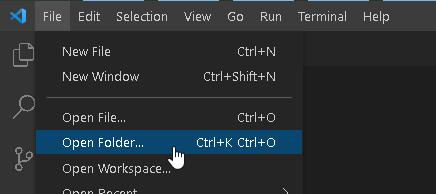

# newleaf-web-resources-applications-entitylookup

Small application used to all 3rd-level filtering on Model-Driven App dropdown/lookup controls.

## Prerequisites

-   Install the latest [Node.JS LTS 22](https://nodejs.org/download/release/v22.17.0/) (currently 22.17.1).

## Getting the Project

`git clone` this repository to your local development directory.

Launch Visual Studio Code (VSC).

Go to the File menu and choose Open Folder...



Navigate to the location where you cloned the repo.


Open a new terminal instance via the Terminal menu.


In the CLI prompt, run the following commands

1. Install `vsts-npm-auth` globally from the official NPM registry

```sh
npm install --global vsts-npm-auth --registry https://registry.npmjs.com --always-auth false
```

2. Use `vsts-npm-auth` to get an Azure DevOps auth for the NewLeaf-Feed of packages

```sh
vsts-npm-auth -config .npmrc -F
```

3. Install required `node_modules` dependencies

```sh
npm install
```

(or in one go)

```sh
npm install --global vsts-npm-auth --registry https://registry.npmjs.com --always-auth false && vsts-npm-auth -config .npmrc && npm install
```

## Setting Up Testing

Inside VSC, click the Extensions icon in the left-hand Activity Bar

In the Search Extensions in Marketplace field, type: [Mocha Test Explorer](https://marketplace.visualstudio.com/items?itemName=hbenl.vscode-mocha-test-adapter) and locate the extension by Holger Benl.

Click the Install button.


_Note_: This will automatically install dependent extensions

-   Test Adapter Converter
-   Test Explorer UI

Click the new Testing icon in the Activity Bar. You may need to also click the Reload tests button in the Testing pane.


Run all tests to verify the setup.


## Code Coverage

To test and report code coverage, open a terminal instance.

Type in the CLI prompt> `npm test`

After the tests have completed, an ASCII table of coverage will be displayed.


Additional (but optional) inline code coverage is available by installing the extension [Coverage Gutters](https://marketplace.visualstudio.com/items?itemName=ryanluker.vscode-coverage-gutters) by ryanluker


Note: You'll need to update modify the extension's settings to all for breakpoint debugging.


-   Turn off (uncheck) Show Gutter Coverage
-   Turn on (add check) Show Line Coverage


Click the Watch button in the status bar to toggle on/off the coverage indicators.


Code coverage is updated each time `npm test` is executed a terminal session.

## Building the Project

In an open terminal instance, type> `npm run build`

This will run `prebuild` items:

-   Formatting
-   Linting
-   Testing

before webpack outputs artifacts into the `/dist` directory.